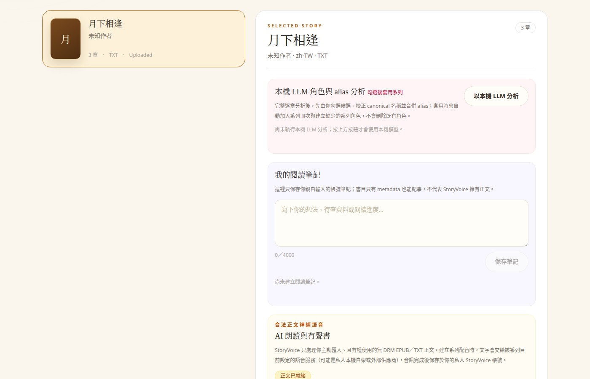

# StoryVoice

**English** | [繁體中文](README.zh-TW.md)

[](https://github.com/NickYCLin/story-voice/actions/workflows/ci.yml)
[](LICENSE)

> **Turn authorized EPUB and TXT files into reviewable, multi-character audiobooks.**

StoryVoice is an open-source, self-hosted production workflow for story analysis,
character bibles, voice casting, human review, and resumable text-to-speech. It is
built with ASP.NET Core, React, PostgreSQL, Redis, and Docker Compose.

Unlike one-click text-to-speech tools, StoryVoice keeps the decisions that matter
visible: who is speaking, which voice is assigned, what still needs review, and
which staged audio is safe to publish.

- [Production app](https://aiprod.wrbtycg.tw/StoryVoice/) — private workspaces require sign-in
- Public product route in this source: `/about?lang=en` — deploy this Web revision before treating the production URL as live
- [Verified project status](docs/PROJECT_STATUS.md)
- [Product and data-model plan](DEVELOPMENT_PLAN.md)
- [UI/UX implementation handoff](docs/VOICE_PLATFORM_UI_UX_HANDOFF.md)

## Why StoryVoice

- **Human-guided, not a black box.** Review character candidates, speaker assignments,
  speech plans, and staged output before anything becomes the active audiobook.
- **Consistent casts across long stories.** Keep canonical characters, aliases,
  narrator settings, and immutable cast revisions consistent across books and chapters.
- **Resumable production.** Persist jobs, leases, progress, retries, and validated audio
  chunks so failed work can continue without rebuilding everything.
- **Self-hosted boundaries.** Keep books, analysis, and generated audio in your own
  deployment while choosing from built-in, local, or explicitly configured TTS providers.
- **Synthetic voice API with explicit authorization.** Approved server-to-server consumers
  can use short-lived private-development grants or a separately governed commercial tier.

StoryVoice is currently optimized for **Traditional Chinese content and Taiwan-Mandarin
voice production**. The architecture is provider-neutral, but the web interface, voice
catalog, and production presets should not yet be treated as fully localized or multilingual.

## Screenshots

### Library and chapter reading



### Character voice studio


### Book collections


The screenshots show the current Traditional Chinese interface with sanitized demo data.

## What is implemented

| Area | Current capability |
|---|---|
| Book intake | Import authorized DRM-free EPUB or UTF-8 TXT; preserve metadata, table of contents, chapter order, and original text |
| Library | Owner-scoped books, reading notes, metadata correction, collections, ordering, and revocable read-only sharing |
| Story analysis | Rule-first and local-LLM-assisted character/alias discovery with confidence and evidence counts |
| Character bible | Canonical characters, aliases, reusable voice profiles, and cross-book series membership |
| Speech planning | Deterministic title, narration, dialogue, inner-monologue, and document-reading segments with human review |
| Voice casting | Server allowlists, fixed narrator/character assignments, immutable cast revisions, and private previews |
| Audio production | Persistent jobs, leases, retries, cancellation, staged multi-character rebuilds, and atomic activation |
| Playback | Private owner-scoped audio, HTTP Range streaming, and browser playback |
| Developer access | Owner-scoped project overview, managed credentials, playground, usage ledger, limits, expiry, and revocation states |
| Operations | PostgreSQL, Redis, background Worker, health checks, structured logging, Docker Compose, and CI |

For evidence-backed completion details and known gaps, see
[`docs/PROJECT_STATUS.md`](docs/PROJECT_STATUS.md).

## Architecture

```text
Authorized EPUB / TXT
         │
         ▼
 Book parser and library
         │
         ▼
 Story analysis ───────────► Character bible
         │                         │
         ▼                         ▼
 Speech-plan review ◄────── Voice casting
         │
         ▼
 TTS provider boundary
         │
         ▼
 Validated staged audio ───► Atomic activation ───► Private player
```

```text
src/
├─ StoryVoice.Api             ASP.NET Core HTTP boundary
├─ StoryVoice.Application     use cases and contracts
├─ StoryVoice.Domain          domain model and invariants
├─ StoryVoice.Infrastructure  EF Core, providers, files, and services
├─ StoryVoice.Worker          durable background narration pipeline
└─ StoryVoice.Web             React 19 + TypeScript + Vite

services/
├─ bluemagpie-gateway         optional internal provider gateway
└─ local-clone-gateway        optional internal synthetic-voice gateway
```

Core infrastructure includes .NET 10, EF Core, PostgreSQL, Redis, Serilog,
OpenAPI, React Router, Tailwind CSS, FFmpeg/ffprobe, nginx, and Docker Compose.

## Quick start

### Prerequisites

- Docker 29 or newer
- Docker Compose v2

```bash
git clone https://github.com/NickYCLin/story-voice.git
cd story-voice
cp .env.example .env
docker compose up --build
```

Open:

- Web UI: <http://localhost:3000>
- API: <http://localhost:8080>
- OpenAPI document in Development mode: <http://localhost:8080/openapi/v1.json>
- Liveness: <http://localhost:8080/health/live>
- Readiness: <http://localhost:8080/health/ready>

Stop the stack with:

```bash
docker compose down
```

Add `-v` only when you intentionally want to remove local PostgreSQL, Redis,
uploaded-book, and generated runtime data.

For a deployment below a reverse-proxy subpath:

```bash
STORYVOICE_BASE_PATH=/StoryVoice/ docker compose up -d --build
```

Compose binds the Web and API services to `127.0.0.1`. Put a TLS reverse proxy
in front of them for external access; see
[`deploy/nginx-storyvoice-location.conf.example`](deploy/nginx-storyvoice-location.conf.example).

## Local development

The pinned .NET SDK is declared in [`global.json`](global.json). The Web CI uses Node.js 22.

Backend:

```bash
dotnet restore StoryVoice.sln
dotnet build StoryVoice.sln
dotnet test StoryVoice.sln
dotnet run --project src/StoryVoice.Api
```

Frontend:

```bash
cd src/StoryVoice.Web
npm ci
npm test
npm run lint
npm run dev
```

Vite proxies `/api` and `/health` to `http://localhost:8080`.
Frontend-specific setup and route notes are in
[`src/StoryVoice.Web/README.md`](src/StoryVoice.Web/README.md).

## Authorized synthetic voice API

StoryVoice includes a **disabled-by-default**, bearer-authenticated server-to-server
speech endpoint. It accepts exactly `voice` and `text`; the browser must never receive
or store the external bearer token.

```bash
curl --request POST 'https://your-storyvoice.example/api/external/v1/speech' \
  --header 'Authorization: Bearer <server-side-token>' \
  --header 'Idempotency-Key: sample-project-20260827-0001' \
  --header 'Content-Type: application/json' \
  --data '{"voice":"authorized-voice-alias","text":"A short authorized test sentence."}' \
  --output preview.wav
```

Two credentials and evidence chains are intentionally isolated:

| Tier | Purpose | Current boundary |
|---|---|---|
| `private-development` / `svd1` | Short-lived integration work | Private, non-public, non-commercial, one project and voice, maximum 30 days |
| `subscription-commercial` / `svv1` | Governed commercial integration | Requires the complete synthetic-origin, provider-rights, catalog, territory, expiry, and revocation chain |

The token prefixes and grant schemas cannot cross tiers. Both paths re-read the
configured evidence and private assets before GPU use. Provisioning, stable errors,
rate limits, idempotency, credential rotation, and revocation are documented in
[`docs/EXTERNAL_VOICE_API.md`](docs/EXTERNAL_VOICE_API.md).

## Optional voice providers

The default stack is deliberately conservative. Optional providers are not enabled by
copying a model name into configuration; each path has its own network, authorization,
model-attestation, licensing, and operational requirements.

| Boundary | Intended use | Default state |
|---|---|---|
| Edge TTS | Built-in narration baseline | Available through the configured server allowlist |
| BlueMagpie gateway | Private Taiwan-Mandarin preview and bounded staged canaries | Disabled; internal Docker network only |
| Local Clone gateway | Owner-scoped preview and authorized synthetic voice execution | Disabled; internal Docker network only |
| External provider adapters | Explicitly configured cloud or internal TTS providers | Disabled until credentials and rights are supplied outside Git |

See the service READMEs and [`.env.example`](.env.example) before enabling an optional path.

## Documentation

| Topic | Document |
|---|---|
| Verified capabilities and next work | [`docs/PROJECT_STATUS.md`](docs/PROJECT_STATUS.md) |
| Long-form product and data-model plan | [`DEVELOPMENT_PLAN.md`](DEVELOPMENT_PLAN.md) |
| Multi-character series/cast design | [`docs/plans/2026-08-11-multi-character-series-cast.md`](docs/plans/2026-08-11-multi-character-series-cast.md) |
| External voice API | [`docs/EXTERNAL_VOICE_API.md`](docs/EXTERNAL_VOICE_API.md) |
| Synthetic voice publication and rights boundary | [`docs/VOICE_PUBLICATION_GRANT.md`](docs/VOICE_PUBLICATION_GRANT.md) |
| UI/UX implementation status | [`docs/VOICE_PLATFORM_UI_UX_HANDOFF.md`](docs/VOICE_PLATFORM_UI_UX_HANDOFF.md) |
| Security reporting | [`SECURITY.md`](SECURITY.md) |
| Contribution workflow | [`CONTRIBUTING.md`](CONTRIBUTING.md) |

Some detailed product and operations documents are currently written in Traditional
Chinese. English API and architecture documentation is being expanded without weakening
the documented authorization and safety boundaries.

## Current limitations

- StoryVoice is under active development and does not yet publish a stable release or SLA.
- The web product is currently optimized for Traditional Chinese; full UI localization is incomplete.
- Taiwan-Mandarin is the most thoroughly exercised voice-production path today.
- The public voice catalog and subscription/payment experience are not ready or enabled by default.
- The commercial voice API must remain disabled until its complete evidence and operational gates are provisioned.
- Rate limiting, idempotency coordination, and single-flight synthesis are currently single-process concerns; review the API documentation before running multiple API replicas.
- Optional models and voice providers may require GPUs, private model caches, credentials, and separate licenses.
- Generated audio quality, latency, and permitted usage depend on the selected provider and its terms.

## Security and content rights

- StoryVoice does **not** provide DRM circumvention.
- Process only content you own or have the right to transform.
- Never commit provider credentials, uploaded books, generated audio, private voice samples,
  database dumps, runtime volumes, or user data.
- API credentials belong in environment variables or a secret manager, never browser code or Git.
- Source-code licensing does not grant rights to third-party models, voices, books, characters,
  or generated output.
- Synthetic voices intended for external API, catalog, public, or commercial use require the
  documented generation evidence, provider-terms review, expiry, scope, and revocation controls.
- Do not use StoryVoice to imitate an identifiable person or claim an unrelated third-party
  character, brand, or official partnership.
- AI-generated output is not automatically licensed for redistribution, and StoryVoice does
  not determine whether a particular output qualifies for copyright protection.

Read [`SECURITY.md`](SECURITY.md) before reporting a vulnerability and
[`docs/VOICE_PUBLICATION_GRANT.md`](docs/VOICE_PUBLICATION_GRANT.md) before enabling
public or commercial synthetic-voice use.

## Contributing

Issues and pull requests are welcome. Start with [`CONTRIBUTING.md`](CONTRIBUTING.md)
before proposing a substantial behavior or provider change.

## License

StoryVoice source code is released under the [MIT License](LICENSE). Third-party models,
voices, source content, and generated output may have separate licenses and terms.
